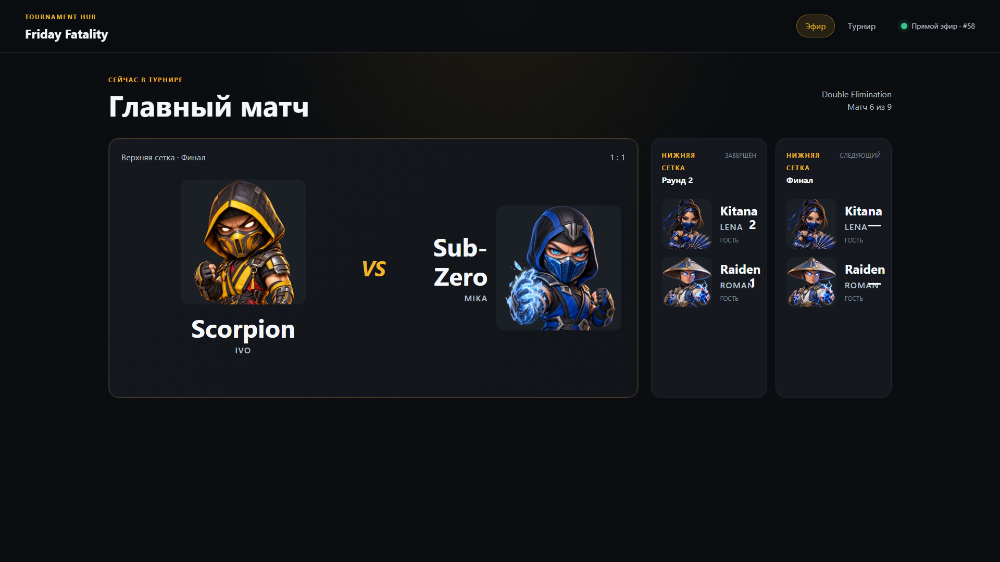
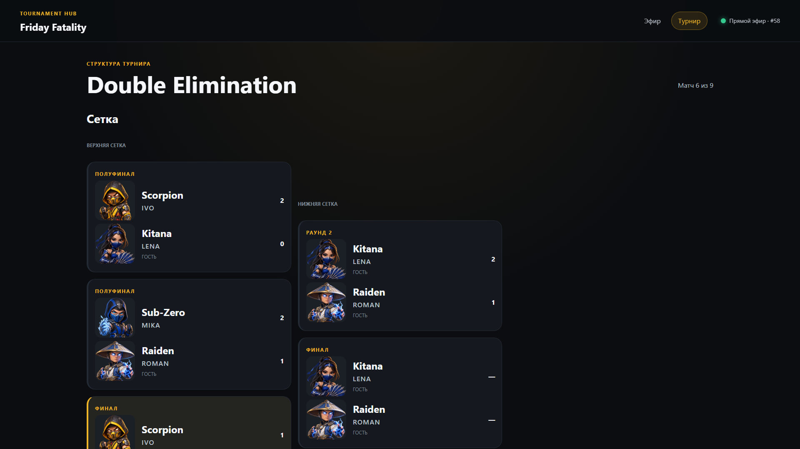
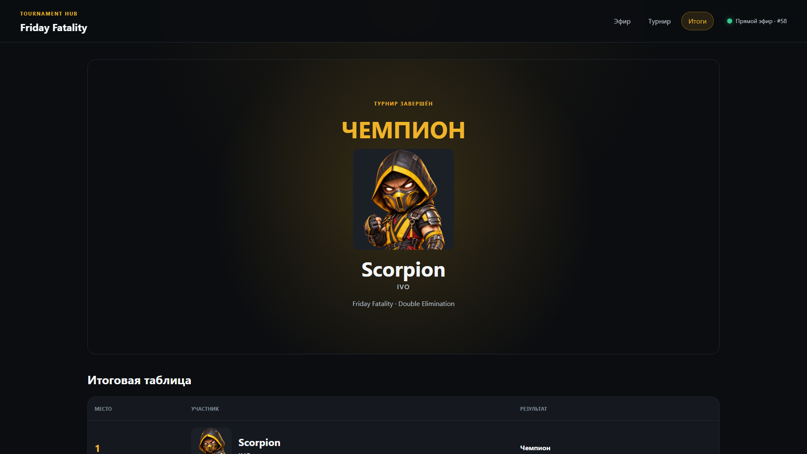
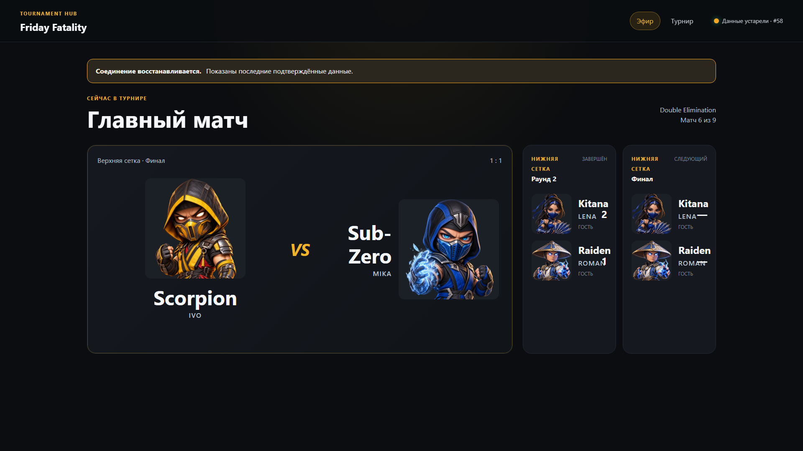
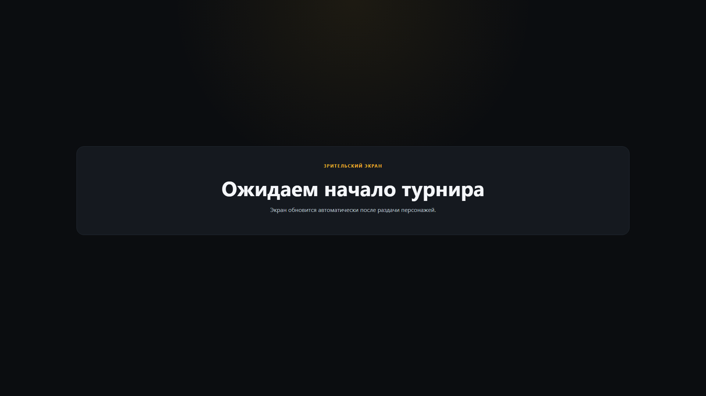
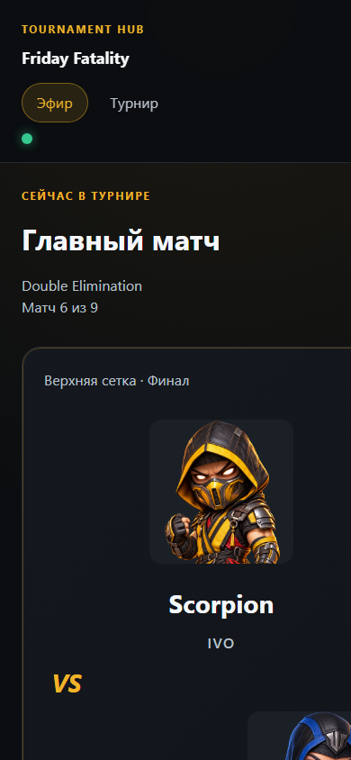

# Spectator Web visual evidence

- Задача: `TH-20260828-053`.
- Дата: 2026-08-31.
- Renderer: Microsoft Edge `152.0.4191.53` headless, Windows, DPR 1.
- Источник данных: synthetic presentation fixture через `visual.html`; production protocol/runtime не подменяется.

Visual harness запускается только Vite development server и собирает production-компоненты экранов из канонических presentation models. Scenario выбирается query-параметром `scenario=dashboard|tournament|champion|stale|waiting`.

## Desktop 1920 × 1080

### Live dashboard

Current matchup остаётся dominant object первого viewport; previous/next и connection freshness читаются одновременно. Fighter artwork и fighter name сопровождают каждую participant identity.

### Tournament structure

Upper/lower brackets разделены текстом и колонками. Current match отличается surface state; structure остаётся read-only и продолжает страницу вертикальным scroll.

### Champion and final standings

Champion artwork является главным идентификатором terminal state; tournament context и начало итоговой таблицы видимы в первом viewport.

### Stale last-known projection

Warning содержит текстовое объяснение, connection status меняет label и marker, а подтверждённый matchup не исчезает и не выглядит единственным live indicator.

### Waiting

Empty network state отделён от tournament content и сообщает об автоматическом обновлении.

## Compact fallback 390 × 844

Header и navigation переходят в вертикальную композицию; matchup identities идут последовательно с крупным artwork. Контент намеренно продолжается вертикальным scroll, горизонтальная структура dashboard не сохраняется на compact width.

## Итог review

- Dashboard, stale и champion сохраняют правильный dominant object.
- Desktop layout читается с расстояния за счёт крупных title/artwork и ограниченного числа соседних surfaces.
- State не передаётся только цветом: live/stale/waiting имеют текстовые labels и status copy.
- Mutation controls отсутствуют во всех сценариях.
- Compact fallback сохраняет fighter identity contract и логический порядок.

Physical TV/browser matrix остаётся release smoke после утверждения OD-009; этот evidence закрывает repository-level screenshot gate, но не заменяет проверку на поддерживаемых устройствах.
